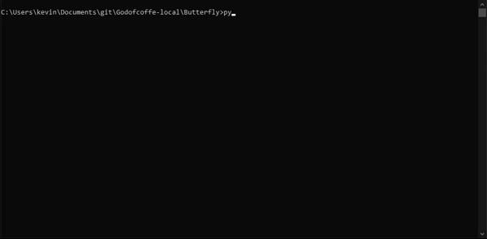

## Installation
```
# clone the repo
$ git clone https://github.com/Godofcoffe/Butterfly.git

# change the working directory to butterfly
$ cd Butterfly

# install the requirements
$ python3 -m pip install -r requirements.txt
```
## Usage
```
$ python3 butterfly.py --help
usage: butterfly.py [-h] [--dir-dst DIR] [--define-ext EXTENSION]
                    [--define-resolution 720p:144p] [--print-streams]
                    [--version]
                    STRINGS [STRINGS ...]

Butterfly: Download Videos, Music or Playlists. (version 0.5.1)

positional arguments:
  STRINGS               One or more links to download. Enclose the link in
                        double quotation marks "".

optional arguments:
  -h, --help            show this help message and exit
  --dir-dst DIR, -p DIR
                        Here, the download destination directory is defined.
                        (default: ./Download)
  --define-ext EXTENSION, -e EXTENSION
                        Defines the extension of the final file mp3 or mp4.
                        (default: mp4)
  --define-resolution 720p:144p, -r 720p:144p
                        Defines the resolution of the video (s) to be
                        downloaded. (default: 480p)
  --print-streams, -s   displays streaming video options such as resolutions,
                        file extensions, bitrate, encoding and more. (default:
                        False)
  --version             Shows the current version of the program.
```
To download just one link:
```
python3 butterfly.py "link"
```
To download more than one link:
```
python3 butterfly.py "link1" "link2" "link3"
```
## LICENSE
MIT © Butterfly Project

Original Creator - [Godofcoffe](https://github.com/Godofcoffe)
